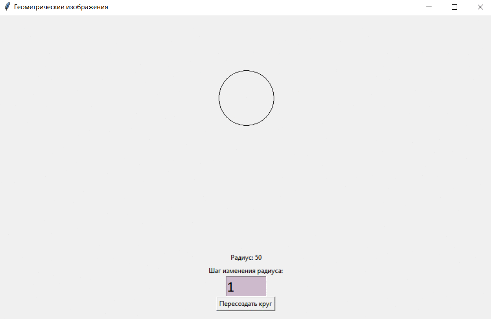

[](https://github.com/RailSafiullin/tkinter_circle_create_resize/actions/workflows/python-app.yml)
# Лабораторная работа по дисциплине "Компьютерная графика" №1. 


## Preview

This program is a graphical Python application that allows you to visualize a geometric figure - a circle, and change its radius using user input.



## How to install and start

```cmd

git clone https://github.com/RailSafiullin/tkinter_circle_create_resize
cd tkinter_circle_create_resize
pip install pytest
python main.py

```

## Task 4

Требуется составить программу, которая строит на экране окружность заданного радиуса R с центром (x, y) (x, y, R - целые). При каждом нажатии клавиши ‘>‘ ее радиус должен изменяться на заданную величину, а клавиши ‘<‘ - уменьшаться. Выход из программы по нажатию клавиши ESC.

## License

Distributed under the Apache License 2.0. See LICENSE.txt for more information.


